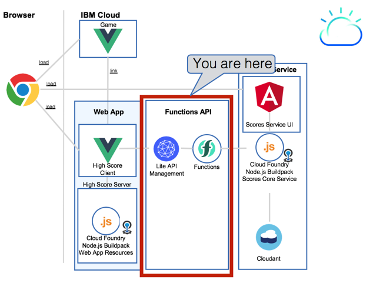
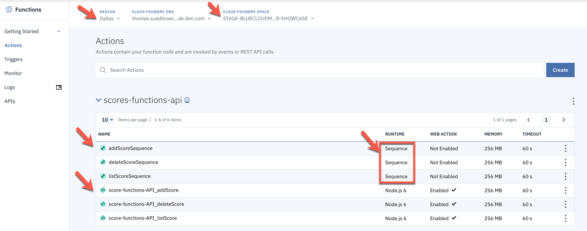
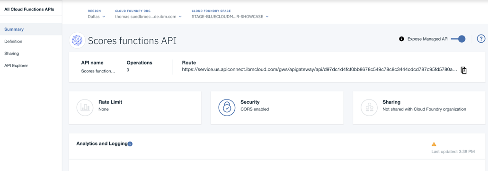
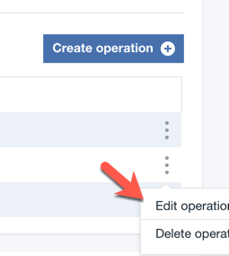
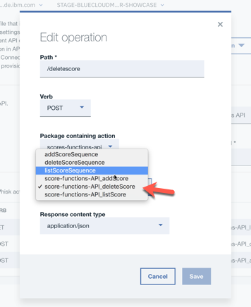
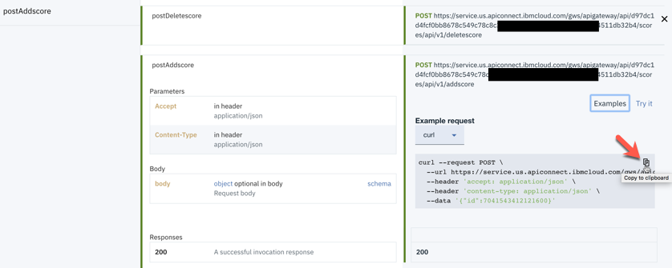

# Functions API

[Back to setup scores and webapp overview](../README.md) 

## Objective

* Setup the **functions API**

## Services used

* Cloud Functions
* Lite API Management

## Architecture

The **functions API** is our serverless approach to secure the **service API** or directly the **scores service**. 
  Later it will be possible integrate with the APP ID service to secure the access to the API with a OOTB user login.
    
  At the moment the IBM Lite API management exposes the APIs, which are implemented with **actions** or **sequences** inside IBM Functions. [IBM Functions](https://console.bluemix.net/openwhisk/) is based on [Apache OpenWhisk](https://openwhisk.apache.org/).

  Inside the **actions**, the access to the **service API** or direclty to **scores service** is enabled and can be configured. The actions will contain the **auth** information for each of them, depening on your the configuration.

In the following image you can see the dependencies of **scores service**, **service API** and **functions API**.

The focus is only on the **functions API**.

You have **two options** in the setup configuration for the **functions api**.

* Option 1: Using the **service API**

    

* Option 2: Using the **scores service**

    


## Setup the scores functions API on IBM Cloud

The setup is automated in a bash script.
You need a IBM Cloud account and an IBM platform key.
This in an overview of the steps to follow.

1. [Get IBM platform key](#part-SETUP-00)
2. [Configurations for bash script automation](#part-SETUP-01)
3. [Options for the API usage in the functions API](#part-SETUP-02)
4. [Enable the bash script for automation](#part-SETUP-03)
5. [Execute the bash script and deploy the scores functions api](#part-SETUP-04)
6. [Verify the setup on IBM Cloud](#part-SETUP-05)
7. [Change the actions to each API call ](#part-SETUP-06)
8. [Save the needed data for the WebApp and Game configuration](#part-SETUP-07)

### 1. Get IBM platform key <a name="part-SETUP-00"></a>

_Note:_ You don't have to do this step, if you already have an IBM platform key.

1. Logon to IBM Cloud use the **"us-south"** Region with the  **https://api.ng.bluemix.net** API endpoint.
```
ibmcloud login -a https://api.ng.bluemix.net
```

2. Create a IBM platform for your API key and name it (example **my-ibmplatform-key**) and provide a filename  (example **my-ibmplatform-key-key_file**).
```
ibmcloud iam api-key-create my-ibmplatform-key -d "This is my API key to access the IBM platform" --file my-ibmplatform-key-key_file
```

Leave your terminal open.

### 2. Configurations for bash script automation <a name="part-SETUP-01"></a>

1. Open the file **[YOUR-ROOT]bluecloudmirror/scores/scores.local.root.env**. This file contains environment variables.

2. Insert the needed values for following entries and do not change the rest.

   **Important for the setup:**
   - Resource Group is case sensitive depending on your system you have to change **d** efault** to **D** efault.

    _Login relevant:_

     * IBMCLOUD_CLI_DEVOPS_PLATFORM_KEY="**[YOUR_PLATFORM_KEY]**"
     * IBMCLOUD_USER_ID="**[YOUR_IBMCLOUD_ID]**"
     * IBMCLOUD_RESOURCE_GROUP=**"default" # or "Default"**

    _Cloud Foundry Apps and services relevant:_
     * IBMCLOUD_CF_ORGANIZATION_NAME="**[YOUR_ORGANIZATION_NAME]**

#### Options for the API usage in the functions API <a name="part-SETUP-02"></a>

You can set two options for the API usage.

 * Usage of the pure **scores-service**
 * Usage of the API defined with API Connect **scores-service-api**
 
This is the environment ariable: **IBMCLOUD_FUNCTIONS_API_TYPE**:

#### Definitions:

  * "SCORES_SERVICE" == use the pure **scores service** in the **functions API**
  * "SCORES_SERVICE_API" == use API defined with API Connect  **scores service API**

  Example:
  * IBMCLOUD_FUNCTIONS_API_TYPE=**"SCORES_SERVICE"**

#### Configurations

  1. To use the **service api** ensure these environment variables are set for the **service-api**. 
  _Note:_ You shoud have configured them in the chapter **service api**.
  

   **Important for the setup:**
   - API Connect URL (score-service-api) must end with YOUR_URL*/*.

    * IBMCLOUD_SCOREAPI_URL="YOUR_URL/"
    * IBMCLOUD_SCOREAPI_CLIENT_ID=""
    * IBMCLOUD_SCOREAPI_CLIENT_SECRET=""

  2. To use the pure **scores service** ensure these environment variables are set for the **scores service**.
  _Note:_ You shoud have configured them in the chapter **scores service**.

    * IBMCLOUD_CF_APP_USER="admin"
    * IBMCLOUD_CF_APP_PASSWORD="a12345678"
    * IBMCLOUD_CF_APP_SERVICE_NAME="bluecloudmirror-scores-service- **YOUR_NAME** "

### 3. Enable the bash script for automation <a name="part-SETUP-03"></a>

Return to your open terminal.
```
cd [YOUR-ROOT]/bluecloudmirror/scores/functions-api
chmod u+x *.sh
```

### 4. Execute the bash script and deploy the scores functions api <a name="part-SETUP-04"></a>

This bash script will deploy the **scores functions api**.
It uses the IBM Functions based on Open Whisk and IBM Lite API Management. 
It creates **actions**, **sequences** and a **api**.

The bash script shows the execution steps. Some steps do take time, be patient.

After the excution you can find a log file in the this folder. The log is called **ibmcloud-create-functions-api.log**. This log contains detailed information about the execution.

```sh
./ibmcloud-create-service-api.sh
```

Here is a sample output of the bash scipt.

```sh
Login to IBM Cloud

_set -o thomas.suedbroecker@de.ibm.com
_create -s STAGE-BLUECLOUDMIRROR-SHOWCASE
_set s STAGE-BLUECLOUDMIRROR-SHOWCASE -g default

_save functions env information
_current wsk namespace is _.
_current wsk api host is openwhisk.ng.bluemix.net.
_current wsk authorization is a111cf2:Hjyj.
_save score service env information
_scores user admin.
_scores password a12345678.
_scores url bluecloudmirror-scores-service-tsuedbro.mybluemix.net.
_api SCORES_SERVICE
Login end


Installing...

_creating package scores-functions-api
_adding parameter to package scores-functions-api
_list parameter
_creating actions
_creating action sequence
_creating API
_setup text-replace
__copy API Definition
__replace FUNCTIONS_SPACE_NAME with thomas.suedbroecker@de.ibm.com_STAGE-BLUECLOUDMIRROR-SHOWCASE
__replace PACKAGE_NAME with scores-functions-api
__replace OPENWHISK_API with https://openwhisk.ng.bluemix.net/api/v1/web
_api https://service.us.apiconnect.ibmcloud.com/gws/apigateway/api/d4/scores/api/v1/addscore https://service.us.apiconnect.ibmcloud.com/gws/apigateway/api/d4/scores/api/v1/deletescore https://service.us.apiconnect.ibmcloud.com/gws/apigateway/api/d9b4/scores/api/v1/getscorelist

Install Complete
```

### 5. Verify the setup on IBM Cloud <a name="part-SETUP-05"></a>

1. Login to IBM Cloud

2. Open **Functions**


3. Select **Actions** in the navigation at the left hand side and verify the **region** **"DALLAS"** and select the same **space**  which is used for the Cloud Foundry App. 
Here you can see the installed **actions** and **sequences**.



4. Press **API**. Here you can find the list of APIs used in your Cloud Foundry space with Functions. Click on the API link you can see in the list.


5. Here you can see a overview



6. Choose **Definition**

Here you can see the uploaded API configuration.
In **Path** you can find the API calls with the releated Actions.
At the moment all related actions are sequences.


### 6. Change the actions to each API call <a name="part-SETUP-06"></a>

For the later usage for the **API Explorer** we need to change the binded actions in the operations for the **functions API**.
The reason is that the uploaded API imformation does contain older auth information from older action instances.

1. Change the used **sequences** for each API call, by using **edit operation**.



2. Now replace each sequence with the concrete action.



3. After the change it should look like this and you can explpore the API definition


### 7. Save the needed data for the WebApp and Game configuration <a name="part-SETUP-07"></a>

**High Scores** relevant

1. Select **Summary** in the API navigation tree. Here you can copy the **Route** URL.


2. Insert the **Route** URL into the **[YOUR-ROOT]bluecloudmirror/scores/scores.local.root.env** file.

  * IBMCLOUD_CF_APP_WEBAPP_FUNCTIONS_API_URL="**YOUR_COPIED_ROUTE_URL**"

**Game** relevant

1. Select **Explore** in the API navigation tree and point to the **postAddscore** operation.


2. Choose try in API defintion and copy the curl statement 



```sh
curl --request POST \ --url https://service.us.apiconnect.ibmcloud.com/gws/apigateway/api/d97dc1b4/scores/api/v1/addscore \ --header 'accept: application/json' \ --header 'content-type: application/json' \ --data '{"id":4864513159462912}'
```

3. Insert the api call in the Game App configuration file [YOUR-ROOT]/bluecloudmirror/**local.env** and save the file.

Example API call for addscore: **https://service.us.apiconnect.ibmcloud.com/gws/apigateway/api/d97dc1b4/scores/api/v1/addscore**

* API_USERS=users-url-not-defined

Now you can use the **Users functions API** in your Game App. :-)

Move on to the next step [webapp](../webapp/README.md) !
