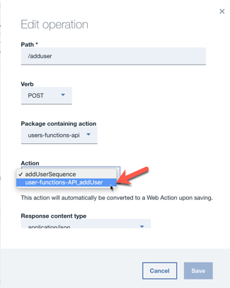

# Functions API

[Back](../README.md) 

## Objective

* Setup the **functions API**

## Services used

* Cloud Functions
* Lite API Management

## Architecture

TBD

## Setup the users functions API on IBM Cloud

The setup is automated in a bash script.
You need a IBM Cloud account and an IBM platform key.
This in an overview of the steps to follow.

1. [Get IBM platform key](#part-SETUP-00)
2. [Configurations for bash script automation](#part-SETUP-01)
3. [Options for the API usage in the functions API](#part-SETUP-02)
4. [Enable the bash script for automation](#part-SETUP-03)
5. [Execute the bash script and deploy the scores functions api](#part-SETUP-04)
6. [Verify the setup on IBM Cloud](#part-SETUP-05)
7. [Change the actions to each API call ](#part-SETUP-06)
8. [Save the needed data for the Game configuration](#part-SETUP-07)

### 1. Get IBM platform key <a name="part-SETUP-00"></a>

_Note:_ You don't have to do this step, if you already have an IBM platform key.

1. Logon to IBM Cloud use the **"us-south"** Region with the  **https://api.ng.bluemix.net** API endpoint.
```
ibmcloud login -a https://api.ng.bluemix.net
```

2. Create a IBM platform for your API key and name it (example **my-ibmplatform-key**) and provide a filename  (example **my-ibmplatform-key-key_file**).
```
ibmcloud iam api-key-create my-ibmplatform-key -d "This is my API key to access the IBM platform" --file my-ibmplatform-key-key_file
```

Leave your terminal open.

### 2. Configurations for bash script automation <a name="part-SETUP-01"></a>

1. Open the file **[YOUR-ROOT]bluecloudmirror/scores/scores.local.root.env**. This file contains environment variables.

2. Insert the needed values for following entries and do not change the rest.

    _Login relevant:_

     * IBMCLOUD_CLI_DEVOPS_PLATFORM_KEY="**[YOUR_PLATFORM_KEY]**"
     * IBMCLOUD_USER_ID="**[YOUR_IBMCLOUD_ID]**"

    _Cloud Foundry Apps and services relevant:_
     * IBMCLOUD_CF_ORGANIZATION_NAME="**[YOUR_ORGANIZATION_NAME]**

#### Definitions:

  * "USERS_SERVICE_API" == use API defined with API Connect  **users service API**

#### Configurations

  1. To use the **service api** ensure these environment variables are set for the **service-api**. 
  _Note:_ You shoud have configured them in the chapter **service api**.

    * IBMCLOUD_USERAPI_URL=""
    * IBMCLOUD_USERAPI_CLIENT_ID=""
    * IBMCLOUD_USERAPI_CLIENT_SECRET=""

### 3. Enable the bash script for automation <a name="part-SETUP-03"></a>

Return to your open terminal.
```
cd [YOUR-ROOT]/bluecloudmirror/users/functions-api
chmod u+x *.sh
```

### 4. Execute the bash script and deploy the scores functions api <a name="part-SETUP-04"></a>

This bash script will deploy the **users functions api**.
It uses the IBM Functions based on Open Whisk and IBM Lite API Management. 
It creates **actions**, **sequences** and a **api**.

The bash script shows the execution steps. Some steps do take time, be patient.

After the excution you can find a log file in the this folder. The log is called **ibmcloud-create-user-api.log**. This log contains detailed information about the execution.

```sh
./ibmcloud-create-users-api.sh
```

Here is a sample output of the bash scipt.

```sh
TBD
```

### 5. Verify the setup on IBM Cloud <a name="part-SETUP-05"></a>

1. Login to IBM Cloud

2. Open **Functions**


3. Select **Actions** in the navigation at the left hand side and verify the **region** **"DALLAS"** and select the same **space**  which is used for the Cloud Foundry App. 
Here you can see the installed **actions** and **sequences**.


4. Press **API**. Here you can find the list of APIs used in your Cloud Foundry space with Functions. Click on the API link you can see in the list.


5. Here you can see a overview


6. Choose **Definition**

Here you can see the uploaded API configuration.
In **Path** you can find the API calls with the releated Actions.
At the moment all related actions are sequences.


### 6. Change the actions to each API call <a name="part-SETUP-06"></a>

For the later usage for the **API Explorer** we need to change the binded actions in the operations for the **functions API**.
The reason is that the uploaded API imformation does contain older auth information from older action instances.

1. Change the used **sequences** for each API call, by using **edit operation**.


2. Now replace each sequence with the concrete action.



3. After the change it should look like this and you can explpore the API definition


### 7. Save the needed data for the Game configuration <a name="part-SETUP-07"></a>

**Game** relevant

1. Select **Explore** in the API navigation tree and point to the **postAddscore** operation.


2. Choose try in API defintion and copy the curl statement 


```sh
curl --request POST \ --url https://service.us.apiconnect.ibmcloud.com/gws/apigateway/api/32e3eb0506333bda774fe953c3e66ee4ec97a8c8f2c1b0fb28611e14769b8120/users/adduser \ --header 'accept: application/json' \ --header 'content-type: application/json' \ --data '{"id":4672220810969088}'
```

3. Insert the api call in the Game App configuration file [YOUR-ROOT]/bluecloudmirror/**local.env** and save the file.

Example API call for addscore: **https://service.us.apiconnect.ibmcloud.com/gws/apigateway/api/32e3eb0506333bda774fe953c3e66ee4ec97a8c8f2c1b0fb28611e14769b8120/users/adduser**

* API_USERS=users-url-not-defined

Now you can use the **Users functions API** in your Game App. :-)

Back [webapp](../README.md) !


